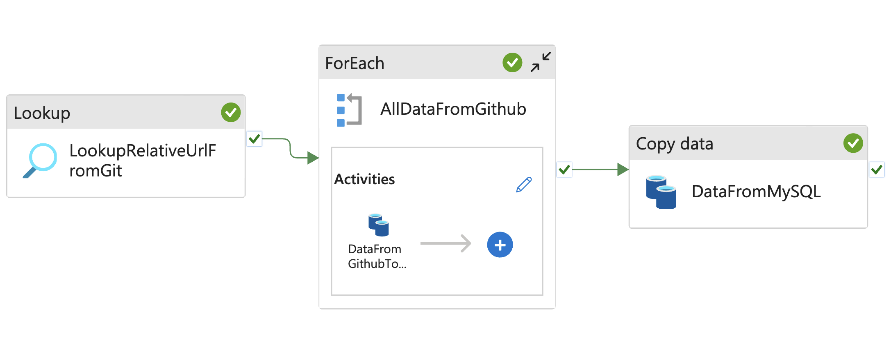
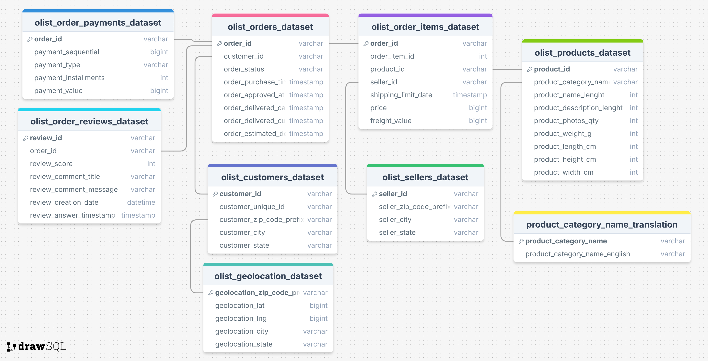

# Olist Data Pipeline

This project implements a scalable data pipeline for the Olist Brazilian e-commerce dataset, facilitating efficient data ingestion, transformation, and preparation for analytics and reporting.

## 📌 Overview

The pipeline is designed to:

- Ingest data from multiple sources, including Https, MySQL and MongoDB.
- Transform and clean data using Databricks(PySpark)/Python scripts.
- Orchestrate workflows with Azure Data Factory.
- Prepare data for downstream analytics and visualization tools.

## 🗂️ Repository Structure

```
.
├── AzureDataFactory/             # Azure Data Factory pipeline definitions
├── Data/                         # Sample datasets and raw input files
├── DataIngestionPipeline.png     # Visual representation of the pipeline architecture
├── databricks_transformation.py  # Data transformation logic using PySpark
├── mongodb_data_ingestion.py     # Script to ingest data into MongoDB
├── mysql_data_ingestion.py       # Script to ingest data into MySQL
├── relative_urls.json            # Configuration file for relative URLs
├── requirements.txt              # Python dependencies
├── transformation.ipynb          # Data transformation logic using Python
└── README.md                     # Project documentation
```

## 🔧 Technologies Used

- **Data Sources**: MySQL, MongoDB
- **Data Processing**: Databricks (PySpark), Python
- **Orchestration**: Azure

## 📈 Data Flow Diagram



## 🧱 Data Schema



---

For more information on the Olist dataset, visit the [Kaggle page](https://www.kaggle.com/datasets/olistbr/brazilian-ecommerce).